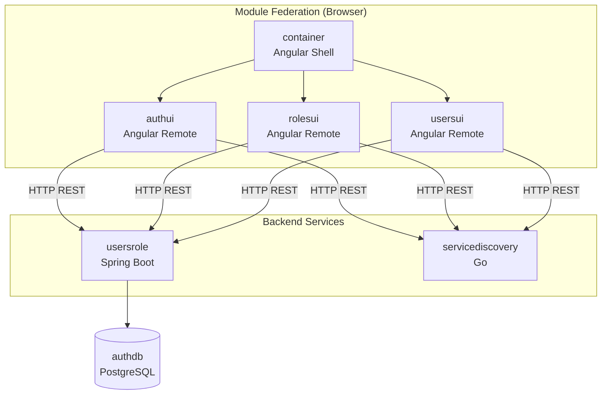
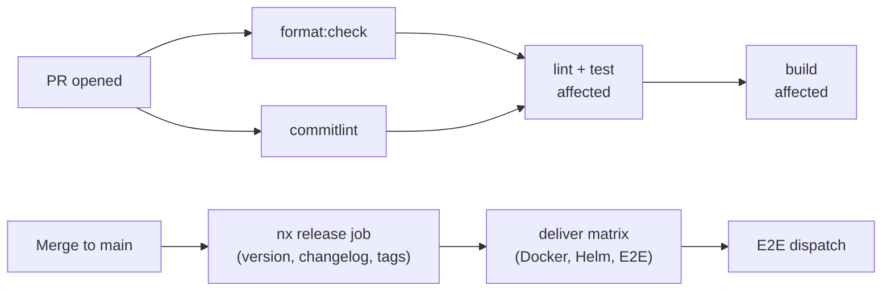

# System Architecture

## Overview

jdwlabs is a micro-frontend + microservice platform. Angular apps are independently deployed MFE remotes loaded at runtime by a shell container. Backend services (Go, Spring Boot) expose REST APIs consumed by Angular data-access libs.

## Service Map

## Nx Project Graph

- **Angular apps** (`type:app`, `framework:angular`) depend on Angular libs in their own scope + `scope:shared`
- **Angular libs** are layered: feature → ui + data-access + util; data-access → util; ui → util
- **Go and Spring Boot** projects are independent — no cross-language TypeScript imports
- **Module federation:** `container` lists remotes in `webpack.config.ts`; remotes are loaded at runtime from their deployed URLs (configured in `src/config.json`)

Run `pnpm exec nx graph` to visualise the live project dependency graph.

## Helm Charts

Each deployable app has a Helm chart in `charts/<app-name>/`. Chart versions (`appVersion`) are bumped automatically by the `update-app` Nx target on release.

## CI/CD Flow

